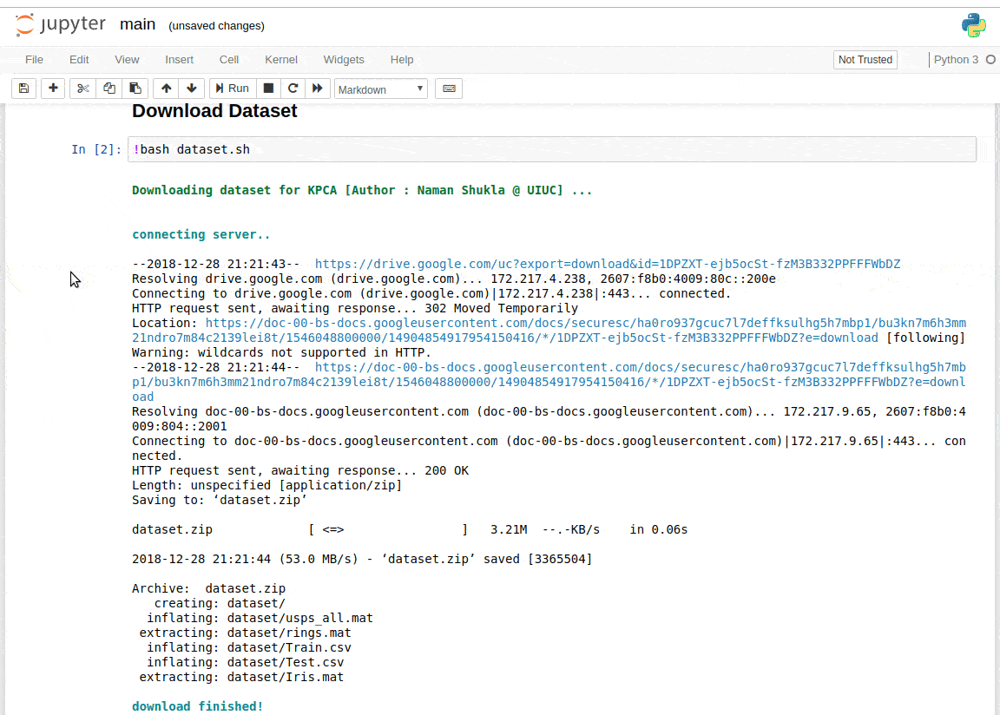
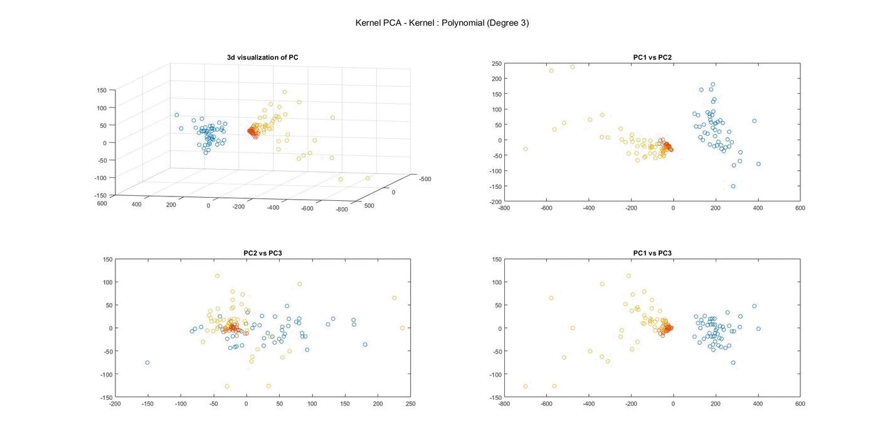
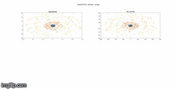

<p align="center">
  
</p>

[](https://mybinder.org/v2/gh/namanUIUC/NonlinearComponentAnalysis/master)


# Nonlinear Component Analysis as a Kernel Eigenvalue Problem

Course project for [IE529: Stats of Big data & Clustering](https://ise.illinois.edu/courses/profile/IE529-120168), 2017 Fall, UIUC


## Description

We implemented the experiments presented in the paper `Nonlinear Component Analysis as a Kernel Eigenvalue Problem` by *Bernhard Schölkopf*, *Alexander Smola*, *Klaus-Robert Müller* [1]. All the articles, references and documentations are present in `docs` folder. Also, we encourage you to have an interactive notebook session via `Binder` either by clicking the above **launch binder** tag.




> **Note**: click on the direct link if the above binder tag is non responsive 
>
> Direct link - https://mybinder.org/v2/gh/namanUIUC/NonlinearComponentAnalysis/master


## Dependencies

In order to run the experiments, make sure you have all dependencies installed
```
matplotlib (>= 2.0.0)
scipy (>=0.19.0)
numpy (>=1.12.1)
sklearn (>=0.0)
```

You can install them by typing

`pip3 install requirements.txt`

The prgramming languages we use are Python and MATLAB. If you do not have access to MATLAB on your laptop. We advise you to install `Octave` instead. You can refer to [this](https://www.gnu.org/software/octave/download.html) webpage for installing.


## Experiments in paper

In the paper, there are two major experiments:
- Toy example: 4-degree Polynomial Kernel PCA
- Character Recognition (USPS Dataset)


## Project implementation

### SVM and KPCA on Iris Dataset
Principal Component Analysis (PCA) is a dimensionality reduction technique that is used to transform and a high-dimensional dataset into a smaller dimensional subspace to give a directed impression of the dataset prior to running a machine learning algorithm on the data. We have extracted features for classification of standard [IRIS](https://en.wikipedia.org/wiki/Iris_flower_data_set) dataset via KPCA.  



### SVC on USPS Dataset

The dataset contains numeric data obtained from the scanning of handwritten digits from envelopes by the U.S. Postal Service. The original scanned digits are binary and of different sizes and orientations; the images here have been deslanted and size normalized, resulting in 16 × 16 grayscale. We will first extract features via Kernel PCA and apply that to a SVM classifier to train and test on the splitted USPS dataset.



## Team 

| Name           | Github Homepage                           |
| -------------- | ----------------------------------------- |
| Jvn Karthik    | N/A                                       |
| Naman Shukla   | [namanUIUC](https://github.com/namanUIUC) |
| Shubham Bansal | N/A                                       |
| Zhenye Na      | [Zhenye-Na](https://github.com/Zhenye-Na) |
| Ziyu Zhou      | [Ziyu0](https://github.com/Ziyu0)         |

## References

[1]. [Nonlinear Component Analysis as a Kernel Eigenvalue Problem](http://www.face-rec.org/algorithms/Kernel/kernelPCA_scholkopf.pdf)
